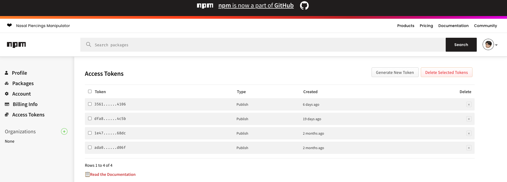
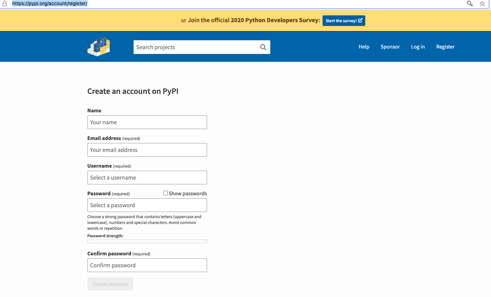
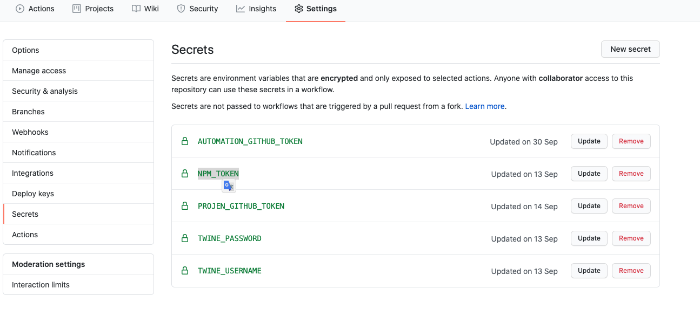

# 1. We use `npx` to call `projen` cli
> any thing we use projen help us modify config ,like `package.json` , `yarn.lock`, `.github workflows`...
```bash
# If we modify .projenrc.js , need to rerun . 
npx projen
```

# 2. `Projen` will help us use yarn to install dependency packages.
> So, we need install `yarn` in your develop environment.
> if you want to install package ,please edit `.projenrc.js` file.
```js
const { AwsCdkConstructLibrary, GithubWorkflow } = require('projen');

const PROJECT_NAME = 'cdk-ecr-image-scan-notify';
const PROJECT_DESCRIPTION = 'A XXX JSII construct lib for AWS CDK';
const AUTOMATION_TOKEN = 'AUTOMATION_GITHUB_TOKEN';
const CDK_VERSION = '1.71.0';
const project = new AwsCdkConstructLibrary({
  name: PROJECT_NAME,
  description: PROJECT_DESCRIPTION,
  repository: 'https://github.com/hayao-k/cdk-ecr-image-scan-notify.git',
  authorAddress: 'user@domain.com',
  authorName: 'hayao-k',
  keywords: ['aws', 'cdk', 'ecr-image', 'scan-notify'],
  dependabot: false,
  compat: true,
  projenUpgradeSecret: AUTOMATION_TOKEN,
  stability: 'experimental',
  cdkVersion: CDK_VERSION,
  deps: [
    '@aws-cdk/aws-iam',
    '@aws-cdk/aws-ec2',
    '@aws-cdk/aws-lambda',
    '@aws-cdk/aws-logs',
    '@aws-cdk/core',
    '@aws-cdk/custom-resources',
  ],
  peerDeps: [
    '@aws-cdk/aws-iam',
    '@aws-cdk/aws-ec2',
    '@aws-cdk/aws-lambda',
    '@aws-cdk/aws-logs',
    '@aws-cdk/core',
    '@aws-cdk/custom-resources',
  ],
  python: {
    distName: PROJECT_NAME,
    module: 'cdk_ecr_image_scan_notify',
  },
});
```
and then, rerun `npx projen`

# 3. If we want publish to npm.org and pypi, we need the npm access token and pypi username and password.
- npm register [link](https://www.npmjs.com/signup)
  

- pypi register [link](https://pypi.org/account/register/)
  
  
- put npm access token and pypi username and password in github secret.
  - npm access token named secret name `NPM_TOKEN`
  - pypi username named secret name `TWINE_USERNAME`
  - pypi password  named secret name `TWINE_PASSWORD`
  

# 4. `Unit Test` , `Build` , `Release`
```bash
# test your constructs library.
yarn test

# test your constructs library and build your code to jsii. and gen some doc like API.md.
yarn build

# git commit .
git add . && git commit -a -m "feat: add awesome feature"

# release Specify version.
yarn bump --release-as 1.0.0 && git push --follow-tags origin [release branch name]

# release example 1.0.1 -> 1.0.2.
yarn release 
```

# 5. For local test you cdk app .
```ts
// edit integ.default.ts in src.
import * as cdk from '@aws-cdk/core';
import { EcrImageScanNorify } from './index';

const mockApp = new cdk.App();
const stack = new cdk.Stack(mockApp, 'testing-stack');

new EcrImageScanNorify(stack, 'ecrimagescan', {
  webhookUrl: 'https://webhook.example.com', // you know this is mock url XD.
  channel: 'event_channel', // you know this is mock channel name XD.
});
```
```bash
# if success , will create lib dir , that will have `index.js` ,`index.d.ts` ,`integ.default.js` ,`integ.default.d.ts`.
yarn build

# deploy
cdk --app='./lib/integ.default.js' deploy -f --require-approval never

# destroy
cdk --app='./lib/integ.default.js' destroy -f
```